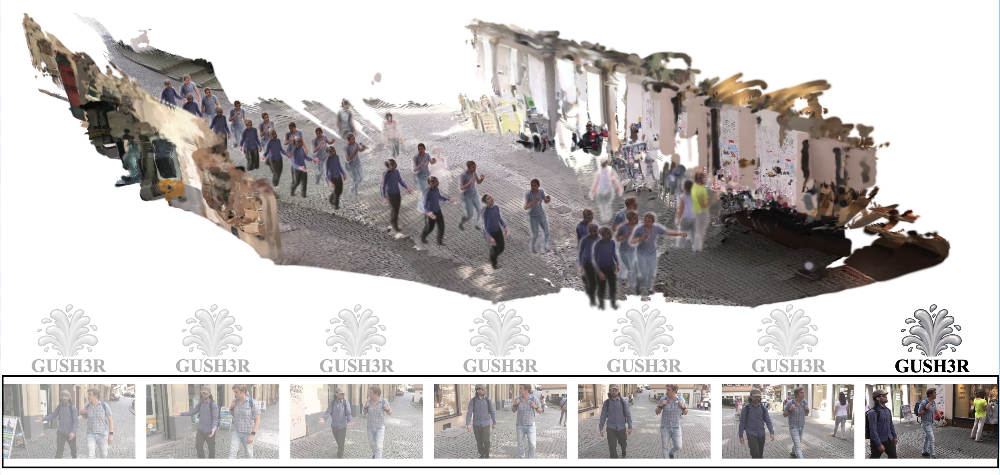

# GUSH3R: Everyone Everywhere All at Once as Gaussians

<a href="https://abkeito.github.io/gush3r-page"></a>
[](https://arxiv.org/pdf/2607.05243)
[](https://huggingface.co/abkeito/GUSH3R)

Keito Abe, [Kaede Shiohara](https://mapooon.github.io/)\*, [Takashi Otonari](https://otonari726.github.io/), 
[Toshihiko Yamasaki](https://www.ee.t.u-tokyo.ac.jp/en/staff/yamasaki-toshihiko/) <br />
The University of Tokyo. \*Project Lead.

## Overview
<p align="center">


Reconstructing dynamic human-scene environments from monocular videos is a challenging problem that requires jointly modeling scene geometry, camera motion, and non-rigid human dynamics while enabling photorealistic rendering. Recent feed-forward methods can efficiently predict geometry, but they are often limited to non-photorealistic representations such as point clouds and meshes, or they fail to handle non-rigid objects, particularly dynamic humans. To fill this gap, we present GUSH3R (Gaussian-Unified Scene Human 3D Reconstruction), a feed-forward framework for online dynamic human-scene reconstruction. From a monocular human-scene video, our method reconstructs dynamic humans (everyone) and static scenes (everywhere) in a single forward pass (all at once) as 3D Gaussian Splatting (3DGS) primitives (as gaussians), which are geometrically consistent and capable of novel view synthesis. Experiments on monocular human-scene datasets demonstrate that our approach achieves competitive novel view synthesis quality while significantly improving inference efficiency compared to optimization-based methods.

## Environment Setup

### 1. Clone GUSH3R.
```bash
git clone https://github.com/abkeito/GUSH3R.git
cd GUSH3R
```

### 2. Create the environment, here we show an example using conda. Python 3.10 is recommended.

```bash
conda create -n gush3r python=3.10 -y
conda activate gush3r
pip install torch==2.2.0 torchvision==0.17.0 --index-url https://download.pytorch.org/whl/cu121
pip install -r requirements.txt
```

### 3. Install PyTorch3D and the Gaussian rasterizer:

```bash
pip install --no-build-isolation git+https://github.com/facebookresearch/pytorch3d.git@2d4d345b6fd2720580bff5f63dcbd3b230b43996
pip install --no-build-isolation git+https://github.com/ashawkey/diff-gaussian-rasterization.git
```


## Required Weights and Assets

GUSH3R needs one merged inference checkpoint and SMPL/SMPL-X related body model files.

### 1. GUSH3R Checkpoint

Place the merged checkpoint here:

```text
checkpoints/gush3r.pth
```

For example, if the checkpoint is hosted on Hugging Face:

```bash
mkdir -p checkpoints
hf download abkeito/GUSH3R checkpoints/gush3r.pth --local-dir .
```

The `gush3r.pth` checkpoint should contain:

- merged background + human model weights
- model construction arguments
- the HumanGS SMPL-X sampling cache

### 2. Body Model Files

SMPL and SMPL-X model files require accepting their official licenses, so they are not included in this repository. 
You can use the helper script below after registering on the official sites:

- SMPL: https://smpl.is.tue.mpg.de/
- SMPL-X: https://smpl-x.is.tue.mpg.de/

```bash
pip install gdown
bash scripts/fetch_body_models.sh
```

The script downloads MultiHMR, prompts for SMPL/SMPL-X credentials, and places files under `src/models/`.

Expected layout:

```text
src/models/
  body_models/
    J_regressor_h36m.npy
    smpl_mean_params.npz
    smplx2smpl.pkl
    smplx2smpl_joints.npy
  multiHMR/
    multiHMR_896_L.pt
  smpl/
    SMPL_FEMALE.pkl
    SMPL_MALE.pkl
    SMPL_NEUTRAL.pkl
    J_regressor_h36m.npy
  smplx/
    SMPLX_FEMALE.npz
    SMPLX_MALE.npz
    SMPLX_NEUTRAL.npz
    ...
```

If the script fails because one of the official download URLs changes, download the files manually from the official websites and copy them into the same layout.

## Run Inference

Put an input video at `examples/demo.mp4`, then run:

```bash
python infer.py \
  --seq_path examples/demo.mp4 \
  --output_dir outputs/demo
```

For a quick smoke test:

```bash
python infer.py \
  --seq_path examples/demo.mp4 \
  --output_dir outputs/demo \
  --max_frames 3
```

The output video is saved to:

```text
outputs/demo/render.mp4
```

Intermediate rendered frames are saved to:

```text
outputs/demo/merged_render/
```

## Useful Inference Options

```bash
python infer.py \
  --seq_path examples/demo.mp4 \
  --output_dir outputs/demo \
  --bg_gaussian_max 2000000 \
  --bg_mask_threshold 0.02 \
  --bg_voxel_size 0.005 \
  --subsample 1
```

Common options:

- `--max_frames`: limit the number of frames for quick tests
- `--subsample`: use every Nth frame
- `--bg_gaussian_max`: maximum number of accumulated background Gaussians
- `--bg_mask_threshold`: human-mask threshold used when filtering background Gaussians
- `--bg_voxel_size`: voxel size for background Gaussian merging
- `--use_ttt3r`: enable TTT3R recurrent update

## Citation

```
@article{abe2026gush3r,
  title   = {GUSH3R: Everyone Everywhere All at Once as Gaussians},
  author  = {Abe, Keito and Shiohara, Kaede and Otonari, Takashi and Yamasaki, Toshihiko},
  journal = {arXiv preprint arXiv:2607.05243},
  year    = {2026}
}
```

## Acknowledgements

We thank all authors behind these projects and repositories for their excellent work: [Human3R](https://arxiv.org/abs/2510.06219), [CUT3R](https://arxiv.org/abs/2501.12387), [AnySplat](https://arxiv.org/abs/2505.23716), [BEDLAM](https://arxiv.org/abs/2306.16940), 

The code in the `src/` is adopted from [Human3R](https://github.com/fanegg/Human3R), which is distributed under the [MIT License](https://github.com/fanegg/Human3R/blob/master/LICENSE).